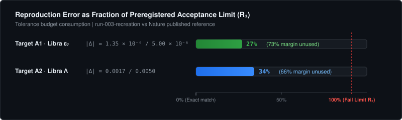
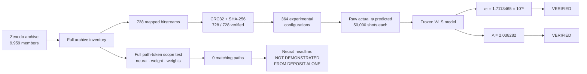
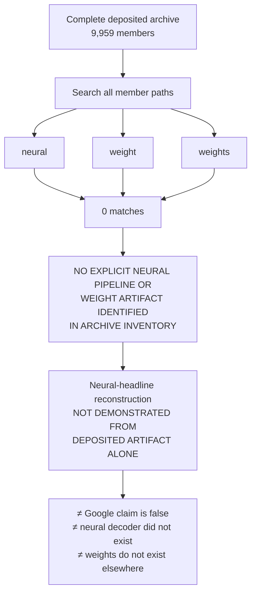
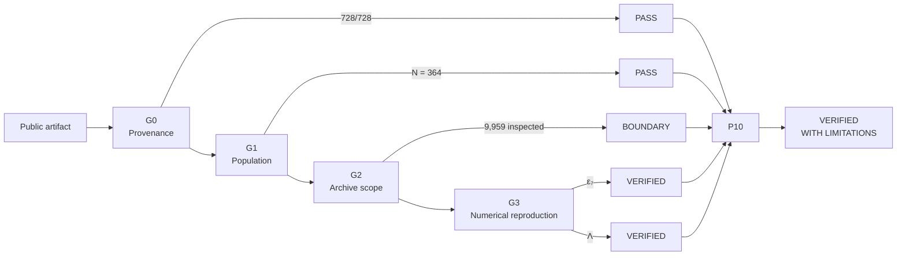

# willow-decoder-s1

## Independent reproduction audit of Google Willow public decoding artifacts

**P10 Instance Verdict:** `VERIFIED WITH LIMITATIONS`  
**Process State:** `RATIFIED`  
**Final Run:** `run-003-recreation`  
**Public Source:** Zenodo [`10.5281/zenodo.13273331`](https://doi.org/10.5281/zenodo.13273331)

> **Two published Libra matching-family quantities were independently reconstructed from the deposited raw bitstreams within preregistered tolerances.**
>
> The deposited artifact was tested for a reconstructible neural-decoder evidence path; none was explicitly identified, so the neural headline itself was not admissible for numerical reproduction.

---

## Audit at a glance

| Evidence | Measured |
| :--- | ---: |
| Complete Zenodo archive inventory | **9,959 members** |
| Source bitstreams cryptographically mapped | **728 / 728** |
| Experimental configurations derived | **364** |
| Bytes in unique evaluated input set | **36,400,000 B** |
| Total application bytes read | **72,800,000 B** |
| File read operations | **1,456** |
| Shot population per bitstream | **50,000** |
| Scientific recreation parity | **10 / 10 fields SAME** |
| Final evidence run exit code | **0** |

---

# Ratified results

| Target | Published | Reconstructed | Absolute $\Delta$ | Preregistered limit | Margin used | Verdict |
| :--- | ---: | ---: | ---: | ---: | ---: | :--- |
| **A1 · Libra $\varepsilon_7$** | `1.7100 × 10⁻³` | **`1.7113465 × 10⁻³`** | `1.35 × 10⁻⁶` | `5.00 × 10⁻⁶` | **27%** | ✅ **VERIFIED** |
| **A2 · Libra $\Lambda$** | `2.0400` | **`2.038282`** | `0.0017` | `0.0050` | **34%** | ✅ **VERIFIED** |
| **B · Neural scope** | `0.143% / Λ=2.14` headline | evidence path not demonstrated in archive | — | archive inventory boundary | — | ⚠️ **NOT DEMONSTRATED FROM DEPOSITED ARTIFACT ALONE** |

### Acceptance-margin view



```text
Preregistered tolerance                              FAIL
0%                                                    100%
│                                                       │
A1 ε₇     █████████████▌                                │ 27%
A2 Λ      █████████████████                             │ 34%
│                                                       │
└──────────── both reproduced well inside R₁ ───────────┘
```

The reference values were used **only after recomputation** for the preregistered comparison step. They were not inputs to the estimator or WLS fit.

---

# Evidence chain



---

# What exactly was reproduced?

The positive result applies to the deposited **Libra matching-family decoder**.

### Target A1 — logical error rate

Published:
$$\varepsilon_7 = 1.71\times10^{-3}$$

Reconstructed from the deposited bitstreams:
$$\boxed{\varepsilon_7 = 1.7113465352358304\times10^{-3}}$$

with
$$|\Delta| = 1.35\times10^{-6}$$

against the preregistered acceptance boundary
$$|\Delta| \le 5.00\times10^{-6}.$$

**Disposition: `Verified`.**

---

### Target A2 — scaling exponent

Published:
$$\Lambda = 2.04$$

Reconstructed:
$$\boxed{\Lambda = 2.038282091967165}$$

with
$$|\Delta| = 0.0017$$

against
$$|\Delta| \le 0.0050.$$

**Disposition: `Verified`.**

---

# What was *not* verified?



The inventory test establishes exactly this:

> **Zero archive paths among 9,959 deposited members contain the preregistered case-insensitive tokens `neural`, `weight`, or `weights`.**

### Methodological Distinction:
1. **Target B was explicitly tested:** The complete 9,959-member archive inventory was evaluated for an admissible neural-decoder reconstruction path, yielding zero explicit matches across all paths.
2. **The neural headline itself was not numerically tested:** Because no reconstructible neural evidence path was demonstrated in the deposit, the neural headline claim ($0.143\% / \Lambda = 2.14$) was not admissible for numerical reproduction from the public artifact alone.
3. **Non-Inference Rule (§15):** This does *not* establish that the archive contains no neural decoder under some non-explicit naming scheme, that neural decoding was not performed experimentally, or that Google's headline claim is false.

And the reproduced Libra matching-family value
$$\Lambda = 2.0383$$
must not be conflated with the separate neural-decoder headline value
$$\Lambda = 2.14.$$

---

# From raw bytes to verdict



---

# Deterministic recreation

The original `run-002-confirmatory` produced the same scientific values but lacked the complete command-bound evidence package.

It was **not repaired or overwritten**.

A separate frozen `run-003-recreation` was executed.

| Recreation field | Result |
| :--- | :--- |
| `N_Libra` | `SAME` |
| `ε₃` | `SAME` |
| `ε₅` | `SAME` |
| `ε₇` | `SAME` |
| `Λ` | `SAME` |
| Target A1 disposition | `SAME` |
| Target A2 disposition | `SAME` |
| Target B disposition | `SAME` |
| experiment count | `SAME` |
| series count | `SAME` |

**Scientific parity: `10 / 10 SAME`.**

---

# Frozen numerical model

### Per-round logical error

$$P_L(r) = \frac{1}{N_{\text{shots}}} \sum_i (\text{actual}_i \oplus \text{predicted}_i)$$

with
$$N_{\text{shots}} = 50,000.$$

For the frozen WLS:
$$p = \operatorname{clip}(P_L, 10^{-7}, 0.499999)$$
$$w_i = \frac{N_{\text{shots}}(1-2p)^2}{4p(1-p)}.$$

### Scaling fit

$$x = \frac{d}{2}, \qquad y = \ln(\bar{\varepsilon}_d)$$
$$w_d = \left(\frac{\bar{\varepsilon}_d}{\sigma_{\bar{\varepsilon}_d}}\right)^2$$
and
$$\Lambda = e^{-m}.$$

No fit parameter was selected after inspection of the target result.

---

# Governance trail

```mermaid
flowchart LR
    R1["run-001<br/>Exploratory"] --> F1["FAILURE #001<br/>freeze-order"]

    V3["Prereg v3"]
    F1 --> V3
    C1["Claude Gate PASS"]
    V3 --> C1
    FR1["Frozen SHA"]
    C1 --> FR1
    R2["run-002<br/>confirmatory"]
    FR1 --> R2

    F2["B-W1<br/>evidence incomplete"]
    R2 --> F2

    V4["Prereg v4<br/>evidence remediation"]
    F2 --> V4
    C2["Claude Gate PASS"]
    V4 --> C2
    FR2["PREREG_SHA<br/>6daa877b..."]
    C2 --> FR2

    R3["run-003-recreation"]
    FR2 --> R3
    C3["Post-execution<br/>SURVIVES-REVIEW"]
    R3 --> C3

    I["Ivan<br/>Operator Ratification"]
    C3 --> I
    END["VERIFIED WITH LIMITATIONS<br/>INSTANCE CLOSED"]
    I --> END
```



Failures remain part of the evidence history. A later successful run does not erase them.

---

# Final evidence

**Frozen preregistration:**
`6daa877b181aa6ca09900589218eac2d1e8a5282`

**Final evidence commit:**
`78dd4a51e6ba68ce09f7a7da93f0b2f1505bc7aa`

**Closure commit:**
`2b2e1645e54d3be4025d57b56a1b24be2030f2f3`

Evidence package:
```text
evidence/runs/run-003-recreation/
├── command.sh
├── stdout.log
├── stderr.log
├── exit_code.txt
├── env.txt
├── git_commit.txt
├── inputs.sha256
├── manifest.sha256
├── bytes_read.json
├── recreation_comparison.json
├── run_metadata.json
├── summary.json
└── outputs.sha256
```

---

## Final disposition

> ### ✅ VERIFIED WITH LIMITATIONS
>
> **Verified:** The deposited Libra matching-family data independently reproduce the published `ε₇` and `Λ` values within preregistered tolerances.
>
> **Limitation:** The deposited artifact was tested for an admissible neural-decoder evidence path; none was explicitly identified, so the neural headline was not admissible for numerical reproduction from the deposited artifact alone.
>
> **No claim of falsification is made.**

`willow-decoder-s1` · **Ratified · Closed**
